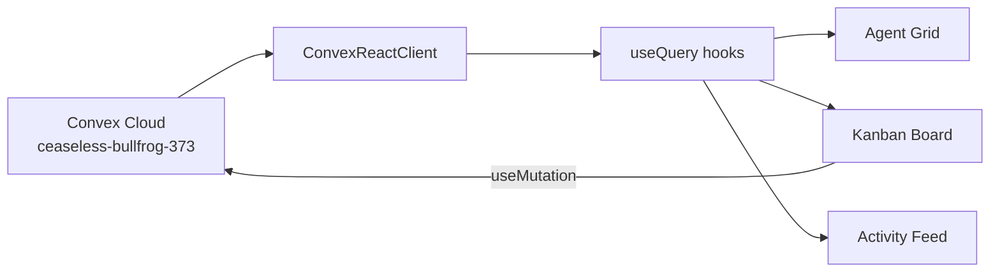

# Architecture

## Overview
Mission Control Dashboard is a Next.js 16 (Turbopack) real-time dashboard that connects to a Convex backend for live agent monitoring, task management (Kanban), and activity tracking.

## Stack
- **Frontend**: Next.js 16, React 19, TypeScript
- **UI**: shadcn/ui + Radix primitives, dark theme, glassmorphism
- **Backend**: Convex (real-time, reactive queries)
- **Drag & Drop**: dnd-kit
- **Deployment**: Vercel

## Data Flow



## Key Components

| Component | Data Source | Convex API |
|-----------|------------|------------|
| `agent-grid.tsx` | Live agents | `api.agents.list` |
| `board.tsx` | Live tasks | `api.tasks.list`, `api.tasks.move` |
| `activity-feed.tsx` | Live activity | `api.activity.list` |

## Convex Schema (Key Tables)
- **agents** — AI agent status, heartbeat, working memory
- **tasks** — Kanban tasks with execution tracking
- **activity** — Event log for all agent/system actions
- **boards** — Domain groupings (Office, Trading, etc.)
- **comments** — Threaded task discussions
- **agentMessages** — Agent-to-agent communication

## Directory Structure
```
mission-control-dashboard/
├── app/              # Next.js pages (/, /agents, /activity)
├── components/       # UI components
│   ├── agents/       # Agent grid, card
│   ├── kanban/       # Board, column, task card
│   ├── activity/     # Activity feed
│   ├── layout/       # Sidebar, header
│   └── ui/           # shadcn/ui primitives
├── convex/           # Convex functions + schema
│   ├── _generated/   # Auto-generated types
│   ├── schema.ts     # Database schema
│   ├── agents.ts     # Agent queries/mutations
│   ├── tasks.ts      # Task queries/mutations
│   ├── activity.ts   # Activity log
│   └── seed.ts       # Seed data
├── lib/              # Utilities, types, Convex provider
└── docs/             # Documentation
```
